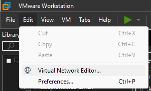

**Home Pen-Testing Lab with VMware Workstation Documentation**

**Introduction**

This document provides a comprehensive guide on setting up a home lab enviroument using VMware Workstation. It is intended for students and pen-testers who are looking to create a virtualized and layered network environment for testing, development, or educational purposes.

**System Requirements**

Before proceeding, ensure your system meets the following minimum requirements:
- Processor: Intel Core i5 or better
- RAM: 8GB minimum (16GB recommended)
- Storage: 256GB SSD or larger
- Operating System: Windows 10 or later / Linux distribution with GUI

**Tools**

1. Attacker Machine - I'll use Kali Linux OS.
2. Firewall - I'll use pfSense.
3. Hypervisor.
4. Vulnerable Machines:
	* Ubuntu (Damn Vulnerable Web Application or DVWA).
	* Windows XP.
	* OWASP Broken Web Apps.
	* Metasploitable.
 
**Network Design**

Since I’ll be using this architecture for Pen-Testing purposes i  want to practice on both multi-layered architecture and flat architecture, the multi-layered architecture is helpful when simulating nearly-real attacks on networks that contains network components like **Firewalls, Routers, etc**, flat architecture can be used to prevent any packet leakage possible and performing first round of testing.
I’ll do this later by adding at least two interface card for each machine but don’t worry we will do that later.

1.Multi-Layer Network Architecture:

2.Flat Network Architecture:

Now let’s get started

**Installation of The Hypervisor**

NOTE: I'll be using VMWare Workstation Pro cause it’s more flexible when dealing with multi-layered networks but you can use any other free Hypervisor Like Virtualbox, Microsoft Hyper-V, etc.
you can also get trial version of VMWare Workstation Pro from here: [Download VMware Workstation Pro](https://www.vmware.com/products/workstation-pro/workstation-pro-evaluation.html).

**Creating a Virtual Machine (VM)**

1. Open VMware Workstation.
2. Click on **File** then **Create a New Virtual Machine**.

3. Select **Typical** for easy configuration since we won’t use advance Options, then click **Next**.

4. Choose **Installer Disc Image file** and click on **Browse** to select the ISO image.

5. Follow the wizard to select the operating system, allocate resources (CPU, memory, disk space), and customize hardware settings.
6. Once the VM is created, power it on and wait till installer starts.

**Setting Up a Virtual Network**

NOTE: to make our multi-layered network architecture we’ll need configure 2 Virtual Network we will name it as VMnet1 for 192.168.10.0/24 subnet and VMnet2 for 192.168.20.0/24 subnet, we will also use the pre-configured NAT subnet which is 192.168.80.0/24.

1. Go to **Edit > Virtual Network Editor**.

2. Click on **Change Settings** which may ask for administrator privileges, Click yes.
3. Click on **Add Network** and Select  **VMnet1** for our first subnet, Click **OK**.
4. Configure the network type:
	- Bridged: VMs will appear as separate devices on your physical network.
	- NAT: VMs will share the host's IP address but remain isolated from the physical network.
	- Host-only: VMs can only communicate with the host and other VMs within the same network.

5. Assign a **subnet IP** and **subnet mask** as follows.

	* Since we will assign static IP Address for each machine we won’t tic the second option “use local DHCP service …”.
6. Repeat steps from 3 to 5 for VMnet2 with Subnet IP 192.168.20.0 and same subnet mask.
7. Apply the changes and close the Virtual Network Editor.

**Configuring Network Settings in VMs**

1. Select the VM you want to configure and Right-click and go to **Settings**.

2. From the bottom of the panel click on **Add** and then Select **Network Adapter** and click **Finish**.

3. Choose the network Adapter you’ve just added and select Custom.
4. Select the Virtual Network that corresponds to the virtual network architecture set up discussed earlier.

5. Click **OK** to Save the settings and restart the VM if needed.

**Testing the Network Configuration**

1. Boot up the VMs connected to the same virtual network.
2. Verify the network configuration inside each VM using network commands (ipconfig on Windows, ifconfig or ip a on Linux).
3. Test connectivity between VMs using ping or other networking tools.

**Setting Up Firewall**

1. Create a new Virtual Machine using the Creating a Virtual Machine (VM) section discussed earlier using the ISO image downloaded from resources links.
	- We can give it **1GB for RAM** and **1 processor for CPU** and based on Network Diagram showed earlier **it should only have 1 network cards which is NAT**
2. Wait till pfSense installer show up.
3. Press **Install**, and select **all the default configurations**.
   

4. Wait till pfSense reboots.
5. Select **2** to set the IP Addresses

6. **Enter 1** to select the interface card we’re going to configure WAN interface.
7. **Enter no** for setting up IPv4 via DHCP
8. **Enter IP Address 192.168.80.1** then **enter 24** for the subnet mask we will use.
   

9. **Press enter** and **enter no** the **press another enter** and **enter no cause** we won’t need webConfigurator protocol.
    

10. Wait till it apply and save new settings.
11. **Now, pfSense is ready to use.**

**Setting Up Kali**

1. Create a new Virtual Machine using the Creating a Virtual Machine (VM) section discussed earlier using the ISO image downloaded from resources links.
2. Boot into operating system.
3. Username is **kali** and password is also **kali**.
4. Open terminal and enter command “**sudo apt-get update && apt-get upgrade**” to install updates
5. Now, Kali is ready to use.

**Setting Up Metasploitable**

1. Create a new Virtual Machine using the Creating a Virtual Machine (VM) section discussed earlier using the ISO image downloaded from resources links.
2. Boot into operating system.
3. Username is **msfadmin** and password is also **msfadmin**.
4. Now, Metasploitable is ready to use.

**Setting Up OWASP Web Broken Apps**

1. Create a new Virtual Machine using the Creating a Virtual Machine (VM) section discussed earlier using the ISO image downloaded from resources links.
2. Boot into operating system.
3. Username is **root** and password is **owaspbwa**.
4. Now, OWASP Web Broken Apps is ready to use.
   
**Setting Up Ubuntu**

1. Create a new Virtual Machine using the Creating a Virtual Machine (VM) section discussed earlier using the ISO image downloaded from resources links.
2. **Select your keyboard layout**.
3. Select **normal installation**, click **Continue**.
4. Select **erase disk**, click **install now**.
   

5. Confirm the installation by clicking **Continue**.
6. **Select your location on the map**.
7. **Configure your user**.
   

8. Wait till system installs and restarts.
9. Boot into operating system.
10. Now, Ubuntu is ready to use.
11. To install Damn Vulnerable Web Application i'll use script written by [IamCarron (github.com)](https://github.com/iamCarron/)
12. Download the script using this command "wget https://raw.githubusercontent.com/IamCarron/DVWA-Script/main/Install-DVWA.sh"
13. Navigate to directory that contains the script and run this command to make the script executable "chmod +x ./Install-DVWA.sh"
14. Run the script as root "sudo ./Install-DVWA.sh"
15. Enter username and password for SQL database
16. To Verify Installation open browser and enter URL http://127.0.0.1/DVWA
17. Enter username admin and password password
18. Now, Ubuntu is ready to use.

**What's Next**
1. Adding Custom Router using Dynamips.
2. Adding Security Onion as IDS.
